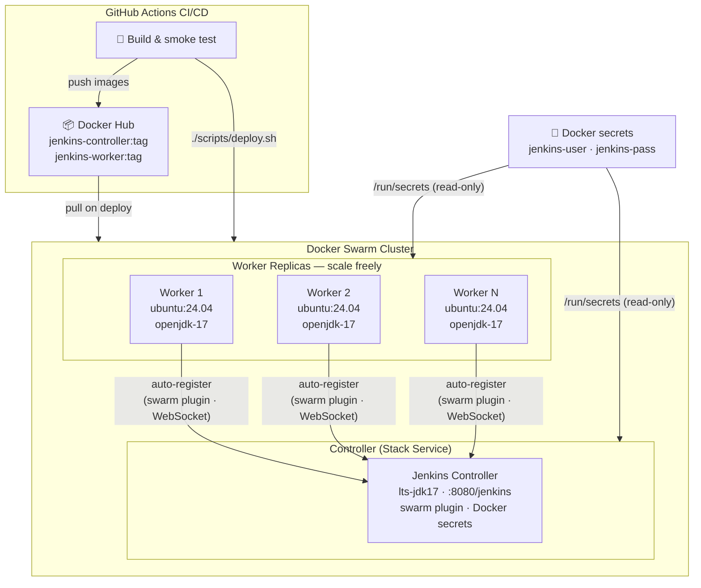
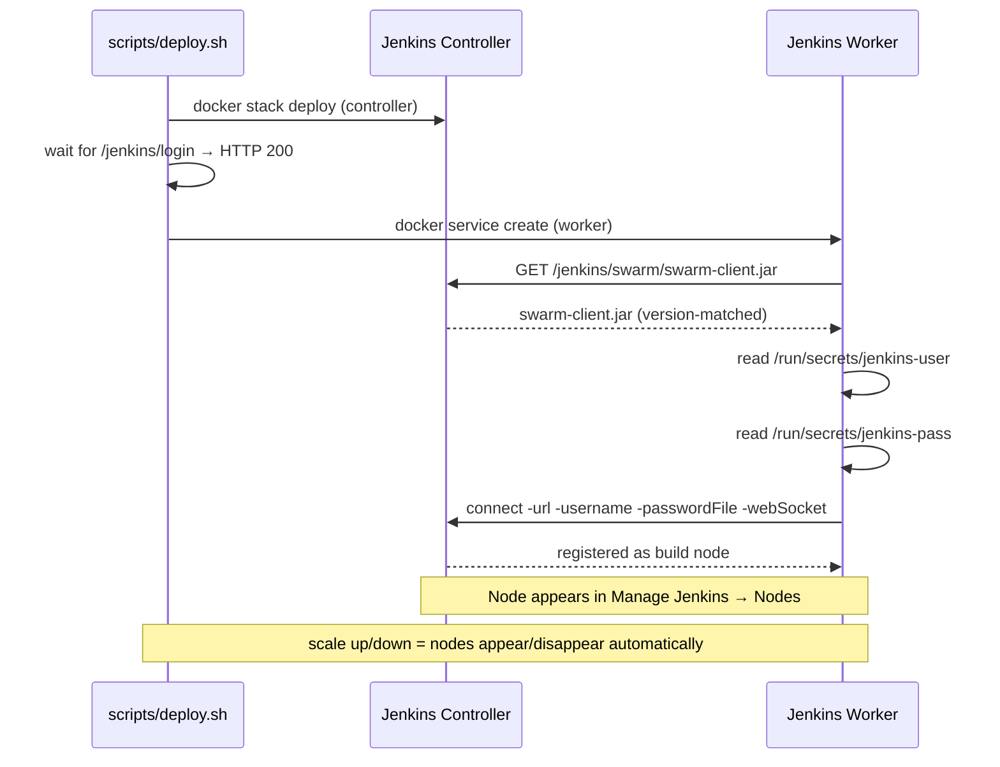
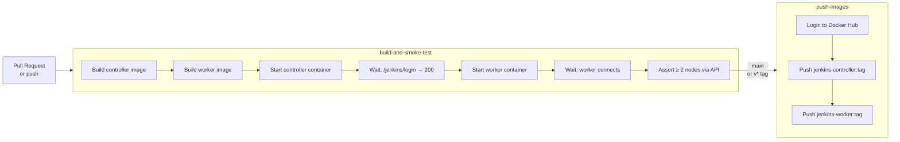

<div align="center">

# deploy-jenkins

**Elastic Jenkins on Docker Swarm — workers find the controller themselves.**

[](https://github.com/sangharshcs/deploy-jenkins/actions/workflows/docker-images.yml)
[](LICENSE)
[](https://www.jenkins.io/changelog-stable/)
[](https://docs.docker.com/engine/swarm/)
[](https://hub.docker.com/_/ubuntu)

Deploy a Jenkins controller and auto-scaling worker pool in minutes.  
Workers register and deregister themselves — no manual node configuration, ever.

[Quick Start](#quick-start) · [How It Works](#how-it-works) · [Scaling](#scaling-workers) · [Configuration](#configuration-reference) · [CI/CD](#cicd) · [Security](#security)

</div>

---

## Why this exists

The conventional way to add a Jenkins build node is painful: navigate to **Manage Jenkins → Nodes**, click through a form, copy a secret, SSH into the machine, run a command, and hope everything lines up. Do that for five workers and you've lost an afternoon.

The [Jenkins Swarm Plugin](https://plugins.jenkins.io/swarm/) inverts this entirely. Workers connect *to* the controller — the controller doesn't reach out to them. Combine that with Docker Swarm's replica scaling and you get a build cluster where capacity is a single command:

```bash
docker service scale jenkins-worker=10
```

Ten workers appear in the Jenkins node list. Scale back down and they disappear cleanly. This repo provides the complete, production-hardened setup to make that work.

---

## Architecture



> Workers download `swarm-client.jar` directly from the controller at startup, then register via WebSocket. By default this repo does **not** expose JNLP port `50000`; set `EXPOSE_AGENT_PORT=1` if you need legacy JNLP connectivity.

---

## Features

- **Zero-touch node registration** — workers self-register via the Jenkins Swarm Plugin; no XML, no UI clicks, no Groovy
- **Elastic capacity** — `docker service scale jenkins-worker=N` and the node list updates in real time
- **Secrets-first** — credentials live in Docker secrets, mounted read-only at `/run/secrets/`; never environment variables
- **Minimal plugin surface** — controller ships with `swarm` only; no plugin sprawl to maintain
- **Unique deploy tags** — every deploy generates a timestamped image tag, eliminating stale `latest` cache bugs
- **Fast-fail deploys** — `deploy.sh` waits for HTTP 200 on `/jenkins/login`, inspects worker logs for startup errors, and exits with actionable output if anything is wrong
- **Full CI pipeline** — GitHub Actions builds both images, runs a full controller + worker smoke test, and pushes to Docker Hub on merge

---

## Quick start

### Prerequisites

- Docker Engine with Swarm mode active
- A Docker Hub account (only needed to push/pull images)

```bash
# Verify Swarm is active
docker info --format '{{.Swarm.LocalNodeState}}'
# → active

# If not:
docker swarm init
```

### 1 — Clone and configure

```bash
git clone https://github.com/sangharshcs/deploy-jenkins.git
cd deploy-jenkins
cp .env.example .env
```

Open `.env` and set the three required values:

```bash
JENKINS_SERVER_IP=<your-server-ip>   # 127.0.0.1 works for local
JENKINS_USER=admin
JENKINS_PASS=<strong-random-password>
```

For local testing, generate a one-off password instead of using weak defaults:

```bash
openssl rand -base64 24
```

### 2 — Deploy

```bash
./scripts/deploy.sh
```

This one command builds both images, creates Docker secrets, deploys the controller stack, waits for it to become healthy, then starts a worker and verifies it connects. If anything fails, it prints the relevant service logs and exits.

### 3 — Open Jenkins

```
http://<JENKINS_SERVER_IP>:8080/jenkins
```

Log in with the credentials you set. Workers are already registered — check **Manage Jenkins → Nodes**.

---

## How it works

### Auto-discovery flow



### Worker startup in detail

`worker/start.sh` does exactly three things:

1. **Downloads** `swarm-client.jar` from the controller at runtime — the version always matches because it comes from the controller itself
2. **Reads credentials** from Docker secrets at `/run/secrets/` — never from environment variables
3. **Connects** with `-webSocket`, so workers reach out to the controller over HTTP — no agent port firewall rules needed

```bash
# The core of worker/start.sh
wget "${JENKINS_CONTROLLER_URL%/}/swarm/swarm-client.jar" -O /home/jenkins/swarm-client.jar

java -jar /home/jenkins/swarm-client.jar \
  -url "${JENKINS_CONTROLLER_URL}/" \
  -username "$(</run/secrets/jenkins-user)" \
  -passwordFile /run/secrets/jenkins-pass \
  -fsroot "${WORKER_ROOT}" \
  -executors "${SWARM_EXECUTORS:-5}" \
  -labels "${SWARM_LABELS:-swarm docker}" \
  -webSocket
```

---

## Scaling workers

Add capacity at any time — the controller needs no changes:

```bash
# Scale up
docker service scale jenkins-worker=5

# Scale back down
docker service scale jenkins-worker=1

# Remove all workers (controller keeps running)
docker service scale jenkins-worker=0
```

Workers register themselves as they start and deregister cleanly when they stop. The Jenkins node list reflects this in real time.

---

## Project layout

```
deploy-jenkins/
│
├── controller/
│   ├── Dockerfile               # jenkins/jenkins:lts-jdk17
│   ├── security.groovy          # Bootstrap: admin user, disable anonymous read
│   ├── plugins.txt              # swarm only
│   └── jenkins_controller.yml   # Docker Swarm stack template
│
├── worker/
│   ├── Dockerfile               # ubuntu:24.04 + openjdk-17
│   └── start.sh                 # Auto-discovery entrypoint
│
├── scripts/
│   ├── common.sh                # Shared env loading, validation, helpers
│   ├── build.sh                 # Build controller + worker images
│   ├── deploy.sh                # Deploy with health checks
│   ├── push.sh                  # Push to Docker Hub
│   ├── logs.sh                  # Tail service logs
│   └── stop.sh                  # Tear down all services
│
├── .github/workflows/
│   └── docker-images.yml        # CI: build → smoke test → push
│
├── .env.example                 # All config vars, documented
└── AGENTS.md                    # Instructions for AI coding agents
```

---

## Script reference

| Command | What it does |
|---|---|
| `./scripts/build.sh` | Build controller and worker images |
| `./scripts/deploy.sh` | Full deploy: build → secrets → stack → health check |
| `SKIP_BUILD=1 ./scripts/deploy.sh` | Deploy without rebuilding |
| `./scripts/push.sh` | Push images to Docker Hub |
| `PUSH_LATEST=1 ./scripts/push.sh` | Push versioned tag + `:latest` |
| `./scripts/logs.sh` | Tail recent logs from both services |
| `TAIL_LINES=300 ./scripts/logs.sh` | Tail more lines |
| `./scripts/stop.sh` | Stop and remove all Jenkins services |

---

## Configuration reference

All configuration lives in `.env`. Copy `.env.example` to get started.

| Variable | Required | Default | Description |
|---|---|---|---|
| `JENKINS_SERVER_IP` | ✅ | — | Host IP workers use to reach the controller |
| `JENKINS_USER` | ✅ | — | Admin username |
| `JENKINS_PASS` | ✅ | — | Admin password |
| `JENKINS_URL_SCHEME` | | `http` | `http` or `https` |
| `UI_PORT` | | `8080` | Controller web UI port |
| `AGENTS_PORT` | | `50000` | JNLP agent port (used only when `EXPOSE_AGENT_PORT=1`) |
| `EXPOSE_AGENT_PORT` | | `0` | Set to `1` to publish JNLP port `50000` |
| `CONTROLLER_ROOT` | | `/opt/jenkins_home` | Host path for Jenkins data |
| `WORKER_ROOT` | | `/opt/worker_home` | Host path for worker workspace |
| `DOCKER_SOCK_MOUNT` | | `1` | Set to `0` to disable mounting `/var/run/docker.sock` into workers |
| `DOCKERHUB_NAMESPACE` | | `sangharshcs` | Docker Hub org/user for image names |
| `CONTROLLER_IMAGE_REPO` | | `<namespace>/jenkins-controller` | Override controller image repo |
| `WORKER_IMAGE_REPO` | | `<namespace>/jenkins-worker` | Override worker image repo |
| `WORKER_REPLICAS` | | `1` | Initial number of worker replicas |
| `ROTATE_SECRETS` | | `0` | Set to `1` to force secret recreation on redeploy |
| `DEPLOY_TAG` | | `<version>-<timestamp>` | Override image tag (e.g. `local-dev`) |

> **Local Docker Desktop:** If `JENKINS_SERVER_IP` is `127.0.0.1` or `localhost`, workers automatically target `host.docker.internal` — no extra config needed.

---

## CI/CD

The included workflow (`.github/workflows/docker-images.yml`) runs on every PR and push:



### Set up CI

Add these to your repo under **Settings → Secrets → Actions**:

| Secret | Value |
|---|---|
| `DOCKERHUB_USERNAME` | Your Docker Hub username |
| `DOCKERHUB_TOKEN` | Docker Hub access token (not your password) |

---

## Security

This setup is designed to avoid the most common Jenkins deployment mistakes:

| Practice | How it's implemented |
|---|---|
| No hardcoded credentials | Credentials come from `.env` (gitignored); `.env.example` has placeholders only |
| Credentials never in env vars | Mounted as Docker secrets at `/run/secrets/` — read by controller bootstrap and worker startup |
| Idempotent admin creation | `security.groovy` checks if the user exists before creating — safe to redeploy |
| Anonymous read disabled | `setAllowAnonymousRead(false)` enforced at bootstrap |
| CSRF protection enabled | `security.groovy` explicitly sets `DefaultCrumbIssuer(true)` |
| Authorization model | Uses `FullControlOnceLoggedInAuthorizationStrategy`; every authenticated user is effectively admin. For multi-user setups, replace this with Matrix Authorization Strategy. |
| Restrictive host permissions | Controller and worker home dirs created with `750` |
| Docker socket risk is explicit | Worker Docker socket mount is configurable (`DOCKER_SOCK_MOUNT=0` disables it). If enabled, Jenkins jobs can access the host Docker daemon. |
| No `NOPASSWD` sudo | Removed from worker image entirely |
| Minimal plugin surface | Controller ships with `swarm` only |
| Unique deploy tags | Timestamped tags per deploy — no stale `latest` cache |
| Credential rotation | `ROTATE_SECRETS=1` forces Docker secret recreation on next deploy |

---

## Troubleshooting

**Controller not starting?**
```bash
./scripts/logs.sh
docker service ps jenkins-controller_main --no-trunc
```

**Worker not connecting?**
```bash
docker service logs --tail 100 jenkins-worker
```
Look for `RetryException`, `HTTP response code: 403`, or `SEVERE:` — these indicate auth or URL misconfiguration.

**Stale secrets from a previous deploy?**
```bash
ROTATE_SECRETS=1 ./scripts/deploy.sh
```

**Start completely fresh?**
```bash
./scripts/stop.sh
docker secret rm jenkins-user jenkins-pass 2>/dev/null || true
./scripts/deploy.sh
```

---

## Contributing

Issues and PRs welcome. If you're extending this:

- Read `AGENTS.md` before changing deploy or startup logic — it documents the security invariants that must not be violated
- Keep credentials out of source files and images
- Preserve the secrets-at-`/run/secrets/` pattern for any new credential handling
- Run `./scripts/build.sh && ./scripts/deploy.sh` locally before opening a PR

---

## Further reading

- [Jenkins Swarm Plugin](https://plugins.jenkins.io/swarm/) — the auto-discovery mechanism this project is built on
- [Docker Swarm mode overview](https://docs.docker.com/engine/swarm/) — orchestration layer
- [Docker secrets](https://docs.docker.com/engine/swarm/secrets/) — how credentials are managed
- [jenkins/jenkins on Docker Hub](https://hub.docker.com/r/jenkins/jenkins) — official Jenkins LTS image

---

## License

MIT — see [LICENSE](LICENSE).

---

<div align="center">

Built by [Sangharsh Agarwal](https://linkedin.com/in/agarwalsangharsh) · [GitHub](https://github.com/sangharshcs)

*Workers find the controller. The controller finds the work.*

</div>
