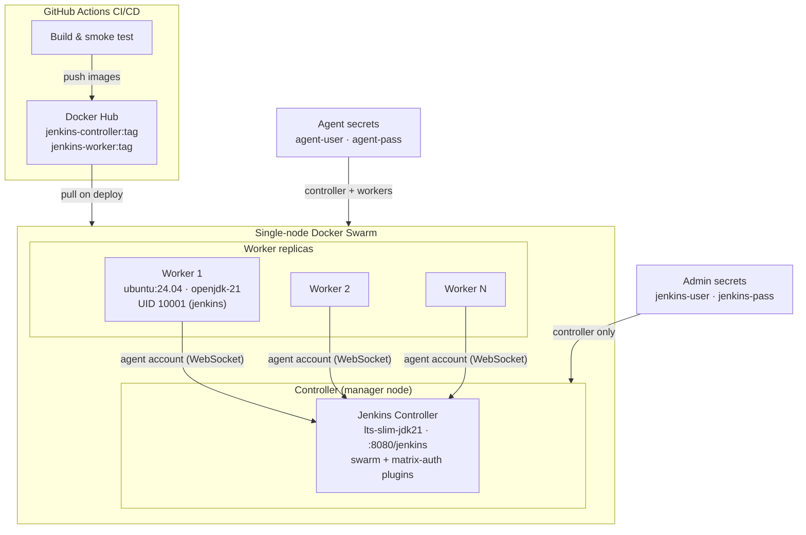
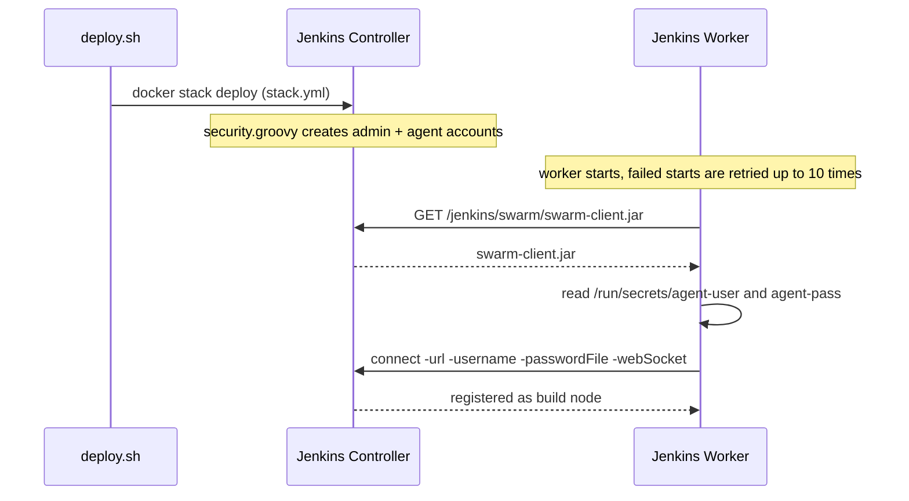
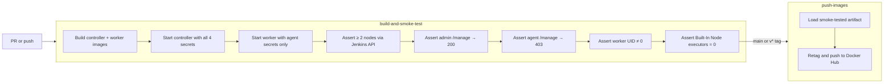

<div align="center">

# deploy-jenkins

**Single-node Jenkins on Docker Swarm, with workers that register themselves.**

[](https://github.com/sangharshcs/deploy-jenkins/actions/workflows/docker-images.yml)
[](LICENSE)
[](https://www.jenkins.io/changelog-stable/)
[](https://docs.docker.com/engine/swarm/)
[](https://hub.docker.com/_/ubuntu)

A small single-node demo for learning. Adapt it to your own setup, and check the parts marked untested before relying on them.

[Quick Start](#quick-start) · [How It Works](#how-it-works) · [Scaling](#scaling-workers) · [HTTPS](#https) · [Configuration](#configuration-reference) · [Security](#security) · [CI/CD](#cicd)

</div>

---

## Why this exists

Adding a Jenkins build node by hand means going through **Manage Jenkins → Nodes**, filling in forms, copying secrets, connecting to the machine and running a command.

The [Jenkins Swarm Plugin](https://plugins.jenkins.io/swarm/) lets workers connect *to* the controller (WebSocket needs plugin 3.22 or later). With Docker Swarm replicas, adding capacity is one command:

```bash
docker service scale jenkins_worker=10
```

This repo has two Docker images, four Docker secrets, one stack file and a deploy script.

---

## Architecture


```mermaid
flowchart TB
    subgraph CI ["GitHub Actions CI/CD"]
        direction LR
        GHA["Build & smoke test"]
        HUB["Docker Hub\njenkins-controller:tag\njenkins-worker:tag"]
        GHA -->|push images| HUB
    end

    subgraph SWARM ["Single-node Docker Swarm"]
        direction TB

        subgraph CTRL ["Controller (manager node)"]
            JC["Jenkins Controller\nlts-slim-jdk21 · :8080/jenkins\nswarm + matrix-auth plugins"]
        end

        subgraph WORKERS ["Worker replicas"]
            direction LR
            W1["Worker 1\nubuntu:24.04 · openjdk-21\nUID 10001 (jenkins)"]
            W2["Worker 2"]
            WN["Worker N"]
        end

        W1 -->|"agent account (WebSocket)"| JC
        W2 -->|"agent account (WebSocket)"| JC
        WN -->|"agent account (WebSocket)"| JC
    end

    HUB -->|pull on deploy| SWARM

    ADMIN_SECRETS["Admin secrets\njenkins-user · jenkins-pass"]
    AGENT_SECRETS["Agent secrets\nagent-user · agent-pass"]
    ADMIN_SECRETS -->|"controller only"| CTRL
    AGENT_SECRETS -->|"controller + workers"| SWARM
```

The controller mounts all four secrets so `security.groovy` can create both accounts. Workers get only the agent pair.

---

## Quick start

### Prerequisites

- Docker Engine with Swarm mode active (`docker swarm init` if needed)
- A Docker Hub account, only if you want to push or pull images

### 1 — Clone and configure

```bash
git clone https://github.com/sangharshcs/deploy-jenkins.git
cd deploy-jenkins
cp .env.example .env
```

Fill in the five required values in `.env`:

```bash
JENKINS_SERVER_IP=<your-server-ip>   # 127.0.0.1 works for a local demo
JENKINS_USER=admin
JENKINS_PASS=<strong-random-password>
AGENT_USER=agent
AGENT_PASS=<different-strong-password>
```

For example, `openssl rand -base64 24` (run twice) generates two passwords.

Workers log in as `AGENT_USER`, which has only the permissions listed in `controller/security.groovy`. CI checks that this account gets 403 on `/manage`. A build job running on a worker can still read `/run/secrets/agent-pass`.

### 2 — Deploy

```bash
./scripts/deploy.sh
```

This builds both images, creates the Docker secrets and deploys the stack.

### 3 — Open Jenkins

```
http://<JENKINS_SERVER_IP>:8080/jenkins
```

The built-in node has 0 executors, so builds do not run inside the controller container. Jobs with no label run on any worker. A job whose label expression is `built-in` waits in the queue with no executor.

The default is plain HTTP, so credentials and the downloaded swarm-client JAR are not encrypted in transit. Use it only on a network you trust. `JENKINS_SERVER_IP=127.0.0.1` does not bind the published port to loopback; the stack publishes port 8080 on the host. See [HTTPS](#https).

---

## How it works


```mermaid
sequenceDiagram
    participant S as deploy.sh
    participant C as Jenkins Controller
    participant W as Jenkins Worker

    S->>C: docker stack deploy (stack.yml)
    Note over C: security.groovy creates admin + agent accounts
    Note over W: worker starts, failed starts are retried up to 10 times

    W->>C: GET /jenkins/swarm/swarm-client.jar
    C-->>W: swarm-client.jar

    W->>W: read /run/secrets/agent-user and agent-pass

    W->>C: connect -url -username -passwordFile -webSocket
    C-->>W: registered as build node
```

`worker/start.sh` reads the agent credentials from `/run/secrets/`, downloads `swarm-client.jar` from the controller if it is not already there, and connects over WebSocket.

Each worker keeps its workspace in its own container filesystem. The files are lost when a replica is removed or replaced.

The worker runs as UID 10001 (`jenkins`). The Docker socket is not mounted by default. Jobs that install packages or write to system paths will fail as non-root. One option is to extend the worker image:

```dockerfile
FROM <your-worker-image>
USER root
RUN apt-get update && apt-get install -y --no-install-recommends <pkg> && rm -rf /var/lib/apt/lists/*
USER jenkins
```

Other options, both untested here: `user: root` on the worker service in `stack.yml`, or the commented socket mount and `user: root` in `stack.yml` for Docker builds. The socket gives build jobs control of the host Docker daemon.

---

## Scaling workers

```bash
docker service scale jenkins_worker=5   # up
docker service scale jenkins_worker=1   # down
docker service scale jenkins_worker=0   # no workers; the controller keeps running
```

**What we observed when scaling down with builds running** (one run, Docker Desktop single node, Freestyle jobs):

- Five workers with one executor each (`SWARM_EXECUTORS=1`), five builds running, then `docker service scale jenkins_worker=1`.
- The four stopped replicas received SIGTERM and exited with code 143 within about a second of each other.
- The four builds running on them failed (`Backing channel '...' is disconnected`), about a second after their last output. Nothing drained or moved them.
- The build on the surviving replica finished normally.
- About a minute later, the four stopped nodes were no longer in the Jenkins node list. We checked once, so the timing is approximate. In an earlier test with idle workers, the removed workers showed as offline right after the command.
- A rolling update of the worker service (changing its environment) stopped a running build the same way, in one run.

**Not observed:** whether `swarm-client` disconnected cleanly (it logs nothing on SIGTERM), Pipeline jobs, or multi-node behavior. The scale-down runs were manual and are not part of CI.

Swarm chooses which replicas to stop, so you cannot pick an idle one with `docker service scale`. If running builds matter, scale down only when none are running.

Scaling down discards the removed replicas' workspaces.

---

## HTTPS

The default is HTTP. This section describes a setup we have not tested.

1. Put a TLS-terminating reverse proxy (nginx, Caddy, Traefik, a load balancer) in front of the host, forwarding to `http://localhost:8080/jenkins`.
2. Block outside access to port 8080.
3. The proxy has to pass the WebSocket `Upgrade` and `Connection` headers.
4. Set the URL workers use in `.env`:

```bash
JENKINS_CONTROLLER_URL=https://jenkins.example.com/jenkins
```

If `JENKINS_CONTROLLER_URL` is not set, `deploy.sh` builds an `http://` URL from `JENKINS_SERVER_IP` and `UI_PORT`.

The worker downloads `swarm-client.jar` with `wget` and then connects with Java, so both need to trust your certificate. If you use a private CA, you would add it to the worker image.

---

## Changing credentials

`deploy.sh` creates a Docker secret only if it does not exist yet, and Docker secrets cannot be edited. To change credentials:

```bash
./scripts/stop.sh        # removes the stack and all four secrets
# edit .env
./scripts/deploy.sh
```

`security.groovy` runs on every controller start and sets both passwords from the mounted secrets. This path has not been tested end to end.

---

## Single-node limitations

- **Images:** `deploy.sh` builds images on the local node and does not distribute them. A multi-node cluster needs a registry that every node can pull from.
- **Controller storage:** `CONTROLLER_ROOT` is a host bind mount. The `node.role == manager` constraint does not pin the controller to one node. On a multi-node cluster it could start on another manager with an empty Jenkins home. A node label or shared storage would be needed.

---

## Project layout

```
deploy-jenkins/
├── stack.yml                    # Docker Swarm stack: controller + worker
├── controller/
│   ├── Dockerfile               # jenkins/jenkins:lts-slim-jdk21
│   ├── security.groovy          # Accounts, matrix authorization, 0 built-in executors
│   └── plugins.txt              # swarm:3.51, matrix-auth
├── worker/
│   ├── Dockerfile               # ubuntu:24.04 + openjdk-21, UID 10001 (jenkins)
│   └── start.sh                 # Worker entrypoint
├── scripts/
│   ├── deploy.sh                # Build, create secrets, stack deploy
│   └── stop.sh                  # Remove the stack and all secrets
├── .github/workflows/
│   └── docker-images.yml        # CI: build, smoke test, push
├── .env.example                 # Configuration variables
└── AGENTS.md                    # Notes for AI coding agents
```

| Command | What it does |
|---|---|
| `./scripts/deploy.sh` | Build, create secrets, deploy |
| `./scripts/deploy.sh --skip-build` | Deploy without rebuilding images |
| `./scripts/stop.sh` | Remove the stack and all four secrets |
| `docker service logs -f jenkins_controller` | Controller logs (use `jenkins_worker` for workers) |

---

## Configuration reference

| Variable | Required | Default | Description |
|---|---|---|---|
| `JENKINS_SERVER_IP` | ✅ | — | Address used in the UI URL and the derived worker URL; does not restrict the published port |
| `JENKINS_USER` | ✅ | — | Admin username |
| `JENKINS_PASS` | ✅ | — | Admin password |
| `AGENT_USER` | ✅ | — | Agent account username (must differ from `JENKINS_USER`) |
| `AGENT_PASS` | ✅ | — | Agent account password |
| `JENKINS_CONTROLLER_URL` | | derived | URL workers use to reach the controller; set it when TLS terminates on a proxy |
| `UI_PORT` | | `8080` | Published host port for the controller |
| `CONTROLLER_ROOT` | | `/opt/jenkins_home` | Host path for Jenkins data |
| `WORKER_ROOT` | | `/opt/worker_home` | Workspace path inside each worker container |
| `DOCKERHUB_NAMESPACE` | | `sangharshcs` | Docker Hub user or org for image names |
| `WORKER_REPLICAS` | | `1` | Initial number of worker replicas |
| `DEPLOY_TAG` | | `<version>-<timestamp>` | Image tag |
| `SWARM_EXECUTORS` | | `5` | Executors per worker |
| `SWARM_LABELS` | | `swarm docker` | Labels on worker nodes |
| `SWARM_WEBSOCKET` | | `true` | Connect with WebSocket |
| `STACK_NAME` | | `jenkins` | Docker stack name |

If `JENKINS_SERVER_IP` is `127.0.0.1` or `localhost`, workers use `host.docker.internal` to reach the controller.

`deploy.sh` checks that Jenkins (UID 1000) can write to `CONTROLLER_ROOT`. If it cannot, the error prints the path; make that directory writable by UID 1000, for example `sudo chown 1000 <path>`.

---

## CI/CD

The workflow runs on every pull request and on pushes to `main`:


```mermaid
flowchart LR
    PR["PR or push"] --> BUILD

    subgraph BUILD ["build-and-smoke-test"]
        direction TB
        B1["Build controller + worker images"]
        B2["Start controller with all 4 secrets"]
        B3["Start worker with agent secrets only"]
        B4["Assert ≥ 2 nodes via Jenkins API"]
        B5["Assert admin /manage → 200"]
        B6["Assert agent /manage → 403"]
        B7["Assert worker UID ≠ 0"]
        B8["Assert Built-In Node executors = 0"]
        B1 --> B2 --> B3 --> B4 --> B5 --> B6 --> B7 --> B8
    end

    B8 -->|"main or v* tag"| PUSH

    subgraph PUSH ["push-images"]
        P1["Load smoke-tested artifact"]
        P2["Retag and push to Docker Hub"]
        P1 --> P2
    end
```

Images are published when a push to `main` or a `v*` tag happens, or when the workflow is run manually (`workflow_dispatch`, from any branch). Pull requests run only the smoke test. The push job loads the images that passed the smoke test; it does not rebuild them.

CI does not test a Swarm deployment, scale-down or HTTPS. The smoke test uses plain `docker run` containers on a bridge network.

To publish from your own fork, add the secrets `DOCKERHUB_USERNAME` and `DOCKERHUB_TOKEN`.

---

## Security

What is set up, and what has actually been checked:

| Item | Notes |
|---|---|
| Admin and agent credentials | Four Docker secrets. `jenkins-user`/`jenkins-pass` go to the controller only; `agent-user`/`agent-pass` go to the controller and the workers. On a deployed worker, a job could not find the admin secret. |
| Matrix authorization | Admin has full control. The agent account has `Hudson.READ` and `Computer.CREATE/CONNECT/DISCONNECT/BUILD`. CI checks only that the agent gets 403 on `/manage`. |
| Credentials | Passed as Docker secrets under `/run/secrets/`, not in the `environment:` section. |
| Anonymous access | No permissions are granted to anonymous. One manual request to `/jenkins/api/json` returned 403. |
| CSRF | `DefaultCrumbIssuer(true)` is set in `security.groovy`. |
| Builds on the controller | The built-in node has 0 executors, because a job there runs next to `/run/secrets/jenkins-pass` and `JENKINS_HOME`. A job on the built-in node could read the admin secret before this was set. |
| Worker user | UID 10001. A job on a worker still reads `/run/secrets/agent-pass` (mode 444), and `apt-get` and writes to `/etc` fail. |
| Docker socket | Not mounted by default. The commented opt-in in `stack.yml` gives build jobs control of the host Docker daemon. Untested here. |
| Plugins | `plugins.txt` lists `swarm` and `matrix-auth`. One deployment also showed two dependencies, `commons-lang3-api` and `ionicons-api`. |
| Transport | HTTP by default; see [HTTPS](#https). |

---

## Troubleshooting

**`deploy.sh` says Jenkins (UID 1000) cannot write to `CONTROLLER_ROOT`:** make the printed directory writable by UID 1000 (`sudo chown 1000 <path>`).

**Controller not starting:**
```bash
docker service logs --tail 100 jenkins_controller
docker service ps jenkins_controller --no-trunc
```

**Worker not connecting:**
```bash
docker service logs --tail 100 jenkins_worker
```
Look for `RetryException`, `HTTP response code: 403` or `SEVERE:`. A 403 can mean the agent account lacks a permission or the credentials do not match.

The service allows up to 10 failed container restart attempts with a 10-second delay between them. This is not a fixed controller startup deadline; check `docker service ps` and worker logs if workers fail to connect.

---

## Contributing

`AGENTS.md` lists the security rules for this repo. Keep credentials out of source files and images, and run `./scripts/deploy.sh` locally before opening a PR.

---

## Further reading

- [Jenkins Swarm Plugin](https://plugins.jenkins.io/swarm/)
- [Matrix Authorization Strategy Plugin](https://plugins.jenkins.io/matrix-auth/)
- [Docker Swarm mode overview](https://docs.docker.com/engine/swarm/)
- [Docker secrets](https://docs.docker.com/engine/swarm/secrets/)

---

## License

MIT — see [LICENSE](LICENSE).

---

<div align="center">

Built by [Sangharsh Agarwal](https://linkedin.com/in/agarwalsangharsh) · [GitHub](https://github.com/sangharshcs)

</div>
