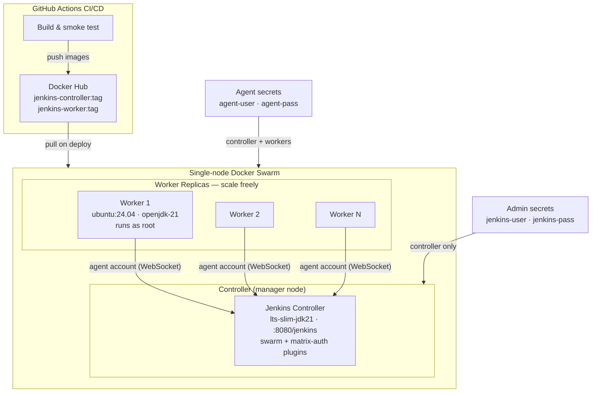
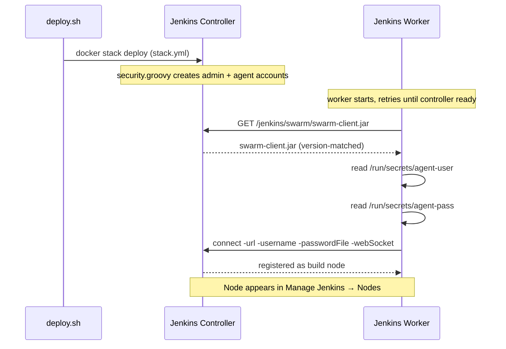
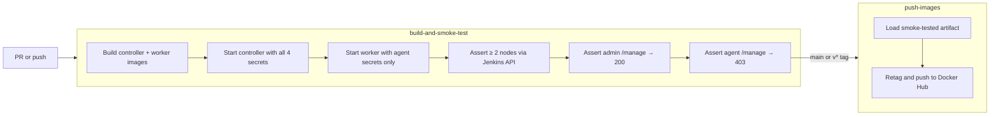

<div align="center">

# deploy-jenkins

**Single-node Jenkins on Docker Swarm — workers find the controller themselves.**

[](https://github.com/sangharshcs/deploy-jenkins/actions/workflows/docker-images.yml)
[](LICENSE)
[](https://www.jenkins.io/changelog-stable/)
[](https://docs.docker.com/engine/swarm/)
[](https://hub.docker.com/_/ubuntu)

A runnable single-node demo. Workers register and deregister themselves — no manual node configuration.  
Adapt it to your own environment; production considerations are called out explicitly.

[Quick Start](#quick-start) · [How It Works](#how-it-works) · [Scaling](#scaling-workers) · [HTTPS](#https) · [Configuration](#configuration-reference) · [Security](#security) · [CI/CD](#cicd)

</div>

---

## Why this exists

Adding a Jenkins build node by hand means navigating **Manage Jenkins → Nodes**, filling forms, copying secrets, SSH-ing into the machine and running a command. Do that five times and you've lost an afternoon.

The [Jenkins Swarm Plugin](https://plugins.jenkins.io/swarm/) (≥ 3.22 for WebSocket) inverts the relationship. Workers connect *to* the controller — the controller never reaches out. Combine that with Docker Swarm replica scaling and capacity becomes a single command:

```bash
docker service scale jenkins_worker=10
```

This repo provides the complete setup: two Docker images, four Docker secrets, one stack file, and a deploy script.

---

## Architecture


```mermaid
flowchart TB
    subgraph CI ["GitHub Actions CI/CD"]
        direction LR
        GHA["Build & smoke test"]
        HUB["Docker Hub\njenkins-controller:tag\njenkins-worker:tag"]
        GHA -->|push images| HUB
    end

    subgraph SWARM ["Single-node Docker Swarm"]
        direction TB

        subgraph CTRL ["Controller (manager node)"]
            JC["Jenkins Controller\nlts-slim-jdk21 · :8080/jenkins\nswarm + matrix-auth plugins"]
        end

        subgraph WORKERS ["Worker Replicas — scale freely"]
            direction LR
            W1["Worker 1\nubuntu:24.04 · openjdk-21\nruns as root"]
            W2["Worker 2"]
            WN["Worker N"]
        end

        W1 -->|"agent account (WebSocket)"| JC
        W2 -->|"agent account (WebSocket)"| JC
        WN -->|"agent account (WebSocket)"| JC
    end

    HUB -->|pull on deploy| SWARM

    ADMIN_SECRETS["Admin secrets\njenkins-user · jenkins-pass"]
    AGENT_SECRETS["Agent secrets\nagent-user · agent-pass"]
    ADMIN_SECRETS -->|"controller only"| CTRL
    AGENT_SECRETS -->|"controller + workers"| SWARM
```

> The controller mounts all four secrets so `security.groovy` can create both accounts on first boot. Workers receive only the agent pair — the admin password never touches a worker container.

---

## Features

- **Zero-touch node registration** — workers self-register; no XML, no UI clicks, no Groovy after the initial bootstrap
- **Elastic capacity** — `docker service scale jenkins_worker=N` updates the node list in real time
- **Separate admin and agent credentials** — workers log in as a dedicated account with only the permissions the Swarm plugin needs; the admin password is a controller-only secret
- **Matrix Authorization** — `GlobalMatrixAuthorizationStrategy` per identity; no blanket full-control-once-logged-in
- **Secrets-first** — all credentials in Docker secrets at `/run/secrets/`; never environment variables
- **Unique deploy tags** — every deploy generates a timestamped image tag, eliminating stale `latest` cache bugs
- **Single stack file** — `stack.yml` with `${VAR:-default}` env var interpolation only

---

## Quick start

### Prerequisites

- Docker Engine with Swarm mode active (`docker swarm init` if needed)
- Docker Hub account (only needed to push/pull images)

### 1 — Clone and configure

```bash
git clone https://github.com/sangharshcs/deploy-jenkins.git
cd deploy-jenkins
cp .env.example .env
```

Open `.env` and fill in the five required values:

```bash
JENKINS_SERVER_IP=<your-server-ip>   # 127.0.0.1 works for a local demo
JENKINS_USER=admin
JENKINS_PASS=<strong-random-password>
AGENT_USER=agent
AGENT_PASS=<different-strong-password>
```

Generate strong passwords:

```bash
openssl rand -base64 24   # run twice — once for JENKINS_PASS, once for AGENT_PASS
```

> **Why two passwords?**  
> Workers log in as `AGENT_USER`. That account can connect agents and run builds, but cannot read other jobs' configuration, manage credentials, or administer Jenkins. If a build job reads `/run/secrets/agent-pass`, it gets only that limited account — not the admin password.

### 2 — Deploy

```bash
./scripts/deploy.sh
```

Builds both images, creates Docker secrets, and deploys the stack.

### 3 — Open Jenkins

```
http://<JENKINS_SERVER_IP>:8080/jenkins
```

> **HTTP is for isolated local demos only.** Credentials and the downloaded swarm-client JAR cross this connection unencrypted. `JENKINS_SERVER_IP=127.0.0.1` only sets the displayed URL and the workers' target; it does **not** bind Swarm's published port to loopback. The stack publishes port 8080 on the host. Restrict inbound access to that port at the host or network boundary and verify it is inaccessible from other machines. See [HTTPS](#https) for networked deployments.

---

## How it works

### Auto-discovery flow


```mermaid
sequenceDiagram
    participant S as deploy.sh
    participant C as Jenkins Controller
    participant W as Jenkins Worker

    S->>C: docker stack deploy (stack.yml)
    Note over C: security.groovy creates admin + agent accounts
    Note over W: worker starts, retries until controller ready

    W->>C: GET /jenkins/swarm/swarm-client.jar
    C-->>W: swarm-client.jar (version-matched)

    W->>W: read /run/secrets/agent-user
    W->>W: read /run/secrets/agent-pass

    W->>C: connect -url -username -passwordFile -webSocket
    C-->>W: registered as build node

    Note over C,W: Node appears in Manage Jenkins → Nodes
```

### Worker startup

`worker/start.sh` reads credentials from `/run/secrets/agent-*`, downloads `swarm-client.jar` from the controller if it isn't already present, and connects via WebSocket.

Each worker replica keeps its workspace in its own container filesystem. Replicas cannot overwrite one another's workspace files, but those files are lost when a replica is removed or replaced. Publish build outputs as Jenkins artifacts or to external storage if they need to persist.

**The worker container runs as root.** The Docker socket is **not** mounted by default. The Docker CLI is present in the image; to enable Docker builds, add the socket mount described in `stack.yml`. See [Security](#security) for what that entails.

---

## Scaling workers

```bash
# Scale up
docker service scale jenkins_worker=5

# Scale back down
docker service scale jenkins_worker=1

# Remove all workers (controller keeps running)
docker service scale jenkins_worker=0
```

**Scale-down behaviour:** when Docker Swarm stops a replica, the `swarm-client` process receives SIGTERM and attempts to deregister. In testing on a single node, the node goes offline in Jenkins within a few seconds of the container stopping. However, if a build is running on that replica when SIGTERM arrives, the build may be marked as failed or aborted depending on Jenkins' in-progress build handling — there is no guaranteed graceful drain. Scale down one replica at a time and verify the node is idle before reducing capacity if build continuity matters.

**Scale-down is not tested in CI.** The smoke test runs plain `docker run` containers, not a Swarm stack.

**Workspace lifecycle:** scaling down discards the removed replicas' workspaces. Scaling up creates fresh, separate workspaces. Do not rely on the worker filesystem as a persistent build cache.

---

## HTTPS

This demo defaults to HTTP. HTTP is acceptable for an isolated single-node demo where the host is not reachable from untrusted networks.

For any networked deployment, place a TLS-terminating reverse proxy (nginx, Caddy, Traefik, a load balancer) in front of the host:

1. The proxy terminates TLS and forwards to `http://localhost:8080/jenkins`.
2. Block direct access to port 8080 from outside the host so the unencrypted endpoint cannot be reached.
3. If using WebSocket mode, ensure the proxy forwards `Upgrade` and `Connection` headers.
4. Tell workers the actual HTTPS URL by setting `JENKINS_CONTROLLER_URL` explicitly in `.env`:

```bash
JENKINS_CONTROLLER_URL=https://jenkins.example.com/jenkins
```

`deploy.sh` passes this value unchanged to workers. It will not silently construct `https://host:8080` — if `JENKINS_CONTROLLER_URL` is not set explicitly, `deploy.sh` always derives an HTTP URL from `JENKINS_SERVER_IP` and `UI_PORT`.

**Certificate requirements:** the worker downloads `swarm-client.jar` using `wget` and then connects with a Java TLS client. Both must trust your certificate. Use a certificate issued by a CA your OS trusts (Let's Encrypt works), or add the CA to the Java trust store in the worker image. A self-signed certificate that is not added to the trust store will fail the `wget` download before the Swarm client even starts.

---

## Credential rotation

Docker secrets are immutable once created. The rotation procedure:

```bash
# 1. Stop the stack and remove all secrets
./scripts/stop.sh

# 2. Update credentials in .env

# 3. Redeploy — secrets are recreated from the new .env values.
#    security.groovy.override runs on every container start and updates
#    the Jenkins internal DB from the mounted secrets.
./scripts/deploy.sh
```

**Changing a password in the Jenkins UI** will be overwritten on the next container restart — Docker secrets are authoritative.

---

## Single-node limitations

This demo is designed for a single-node Swarm:

- **Image distribution:** locally built images are available on the current node. A multi-node cluster requires a shared registry; `deploy.sh` does not distribute images to other nodes.
- **Controller storage:** `CONTROLLER_ROOT` is a host bind mount. The `node.role == manager` placement constraint keeps the controller on the manager node, which on a single-node Swarm is the only node. On a multi-node cluster with multiple managers, this constraint does *not* pin the controller to one specific host — it may reschedule to a different manager and lose the bind-mounted volume. Use a node label (`node.labels.jenkins==controller`) or shared storage (NFS/EFS) for multi-node deployments.

---

## Project layout

```
deploy-jenkins/
│
├── stack.yml                    # Docker Swarm stack — controller + worker
│
├── controller/
│   ├── Dockerfile               # jenkins/jenkins:lts-slim-jdk21
│   ├── security.groovy          # Bootstrap: admin + agent accounts, Matrix Auth
│   └── plugins.txt              # swarm:3.51, matrix-auth
│
├── worker/
│   ├── Dockerfile               # ubuntu:24.04 + openjdk-21, runs as root
│   └── start.sh                 # Agent entrypoint (uses agent-user/agent-pass)
│
├── scripts/
│   ├── deploy.sh                # Build → secrets → stack deploy
│   └── stop.sh                  # Tear down stack + remove all Docker secrets
│
├── .github/workflows/
│   └── docker-images.yml        # CI: build → smoke test → privilege checks → push
│
├── .env.example                 # All config vars, documented
└── AGENTS.md                    # Instructions for AI coding agents
```

---

## Script reference

| Command | What it does |
|---|---|
| `./scripts/deploy.sh` | Full deploy: build → secrets → stack deploy |
| `./scripts/deploy.sh --skip-build` | Deploy without rebuilding images |
| `./scripts/stop.sh` | Stop stack and remove all Docker secrets |
| `docker service scale jenkins_worker=N` | Scale workers up or down |
| `docker service logs -f jenkins_controller` | Tail controller logs |
| `docker service logs -f jenkins_worker` | Tail worker logs |

---

## Configuration reference

| Variable | Required | Default | Description |
|---|---|---|---|
| `JENKINS_SERVER_IP` | ✅ | — | Address used in the displayed UI URL and derived worker URL; does not restrict the published port |
| `JENKINS_USER` | ✅ | — | Admin username |
| `JENKINS_PASS` | ✅ | — | Admin password |
| `AGENT_USER` | ✅ | — | Dedicated agent account username |
| `AGENT_PASS` | ✅ | — | Dedicated agent account password |
| `JENKINS_CONTROLLER_URL` | | derived | Explicit URL workers use to reach the controller; set when TLS terminates on an external proxy |
| `UI_PORT` | | `8080` | Published host port for the controller (container port is 8080) |
| `CONTROLLER_ROOT` | | `/opt/jenkins_home` | Host path for Jenkins data |
| `WORKER_ROOT` | | `/opt/worker_home` | Workspace path inside each worker container; ephemeral and isolated per replica |
| `DOCKERHUB_NAMESPACE` | | `sangharshcs` | Docker Hub org/user for image names |
| `WORKER_REPLICAS` | | `1` | Initial number of worker replicas |
| `DEPLOY_TAG` | | `<version>-<timestamp>` | Override image tag |
| `SWARM_EXECUTORS` | | `5` | Number of executors per worker |
| `SWARM_LABELS` | | `swarm docker` | Labels assigned to worker nodes |
| `SWARM_WEBSOCKET` | | `true` | Use WebSocket for agent connection |
| `STACK_NAME` | | `jenkins` | Docker stack name |

> **Local Docker Desktop:** if `JENKINS_SERVER_IP` is `127.0.0.1` or `localhost`, workers automatically target `host.docker.internal` so they can reach the controller from inside the Swarm overlay network.

> **`CONTROLLER_ROOT` permissions:** `deploy.sh` creates this directory and verifies that Jenkins (UID 1000) can write to it. If the check fails, the error message prints the actual path. Make that directory writable by UID 1000 before redeploying. Using the `.env.example` default path as the example:
> ```bash
> sudo chown 1000 /tmp/jenkins_home
> ```
> Replace `/tmp/jenkins_home` with the path shown in the error message. Avoid `chown -R` on an existing Jenkins home — it may corrupt files owned by other UIDs inside the volume.

---

## CI/CD

The workflow runs on every PR and push to `main`:


```mermaid
flowchart LR
    PR["PR or push"] --> BUILD

    subgraph BUILD ["build-and-smoke-test"]
        direction TB
        B1["Build controller + worker images"]
        B2["Start controller with all 4 secrets"]
        B3["Start worker with agent secrets only"]
        B4["Assert ≥ 2 nodes via Jenkins API"]
        B5["Assert admin /manage → 200"]
        B6["Assert agent /manage → 403"]
        B1 --> B2 --> B3 --> B4 --> B5 --> B6
    end

    B6 -->|"main or v* tag"| PUSH

    subgraph PUSH ["push-images"]
        P1["Load smoke-tested artifact"]
        P2["Retag and push to Docker Hub"]
        P1 --> P2
    end
```

The push job loads the exact images that passed the smoke test — it does not rebuild.

**What CI does not test:** Docker Swarm stack deployment, scale-down behaviour, and HTTPS connections. The smoke test runs plain `docker run` containers on a bridge network.

**Publishing triggers:** images are published when `push` fires on `main`, when a `v*` tag is pushed, or when `workflow_dispatch` is used. Pull requests run the smoke test only.

### Set up CI

| Secret | Value |
|---|---|
| `DOCKERHUB_USERNAME` | Your Docker Hub username |
| `DOCKERHUB_TOKEN` | Docker Hub access token |

---

## Security

| Practice | How it's implemented |
|---|---|
| Separate admin and agent credentials | Four Docker secrets: `jenkins-user`/`jenkins-pass` on the controller only; `agent-user`/`agent-pass` on controller (to create the account) and workers |
| Matrix Authorization | `GlobalMatrixAuthorizationStrategy` (matrix-auth plugin) — the agent account has `Hudson.READ`, `Computer.CREATE/CONNECT/DISCONNECT/BUILD`; no access to jobs, credentials, or administration |
| Credentials never in env vars | Mounted as Docker secrets at `/run/secrets/`; never in the `environment:` section |
| Secrets as source of truth | `security.groovy.override` runs on every container start and updates both accounts from mounted secrets |
| Anonymous read disabled | Enforced in `security.groovy` |
| CSRF protection | `DefaultCrumbIssuer(true)` set in `security.groovy` |
| Worker runs as root | Startup downloads the Swarm client into `/opt`. Worker workspaces are isolated in their containers; the Docker socket is **not** mounted by default |
| Docker socket opt-in | To enable Docker builds, add the socket mount shown in `stack.yml`. **This gives every build job full control of the host Docker daemon** — it can start privileged containers, read host paths, and reach any secret accessible to the Docker daemon, including the Jenkins home. The separate agent Jenkins account does not limit what a build job can do once it has a root shell and a Docker socket |
| Controller placement | `node.role == manager` keeps the controller on a manager node. On a single-node Swarm this is always the only node. See [Single-node limitations](#single-node-limitations) for multi-node caveats |
| Minimal plugin surface | Controller ships with `swarm` and `matrix-auth` only |
| HTTP limitation | Default deployment is HTTP. Credentials and swarm-client JAR are unencrypted in transit. See [HTTPS](#https) for external proxy guidance |

---

## Troubleshooting

**`deploy.sh` fails with "Jenkins (UID 1000) cannot write to CONTROLLER_ROOT":**  
`deploy.sh` creates the directory and runs a write-access check using the controller image. If the current user owns the directory and it was created with mode 750, UID 1000 has no write access. The error message prints the actual path — use that path in the fix:
```bash
sudo chown 1000 /tmp/jenkins_home   # replace with the path in the error message
```
Avoid `chown -R` on an existing Jenkins home — it may corrupt files owned by other UIDs inside the volume.

**Controller not starting?**
```bash
docker service logs --tail 100 jenkins_controller
docker service ps jenkins_controller --no-trunc
```

**Worker not connecting?**
```bash
docker service logs --tail 100 jenkins_worker
```
Look for `RetryException`, `HTTP response code: 403`, or `SEVERE:`. A 403 usually means the agent account is missing a permission or the credentials don't match.

**Worker restart policy exhausted:**  
If the controller takes more than ~100 s to pass its healthcheck, workers exhaust retries before connecting. Scale them back up:
```bash
docker service scale jenkins_worker=0
docker service scale jenkins_worker="${WORKER_REPLICAS:-1}"
```

**Stale secrets:**
```bash
./scripts/stop.sh   # removes stack and all four secrets
# edit .env
./scripts/deploy.sh
```

---

## Contributing

- Read `AGENTS.md` for security invariants that must not be violated
- Keep credentials out of source files and images
- Run `./scripts/deploy.sh` locally before opening a PR

---

## Further reading

- [Jenkins Swarm Plugin](https://plugins.jenkins.io/swarm/)
- [Matrix Authorization Strategy Plugin](https://plugins.jenkins.io/matrix-auth/)
- [Docker Swarm mode overview](https://docs.docker.com/engine/swarm/)
- [Docker secrets](https://docs.docker.com/engine/swarm/secrets/)

---

## License

MIT — see [LICENSE](LICENSE).

---

<div align="center">

Built by [Sangharsh Agarwal](https://linkedin.com/in/agarwalsangharsh) · [GitHub](https://github.com/sangharshcs)

*Workers find the controller. The controller finds the work.*

</div>
